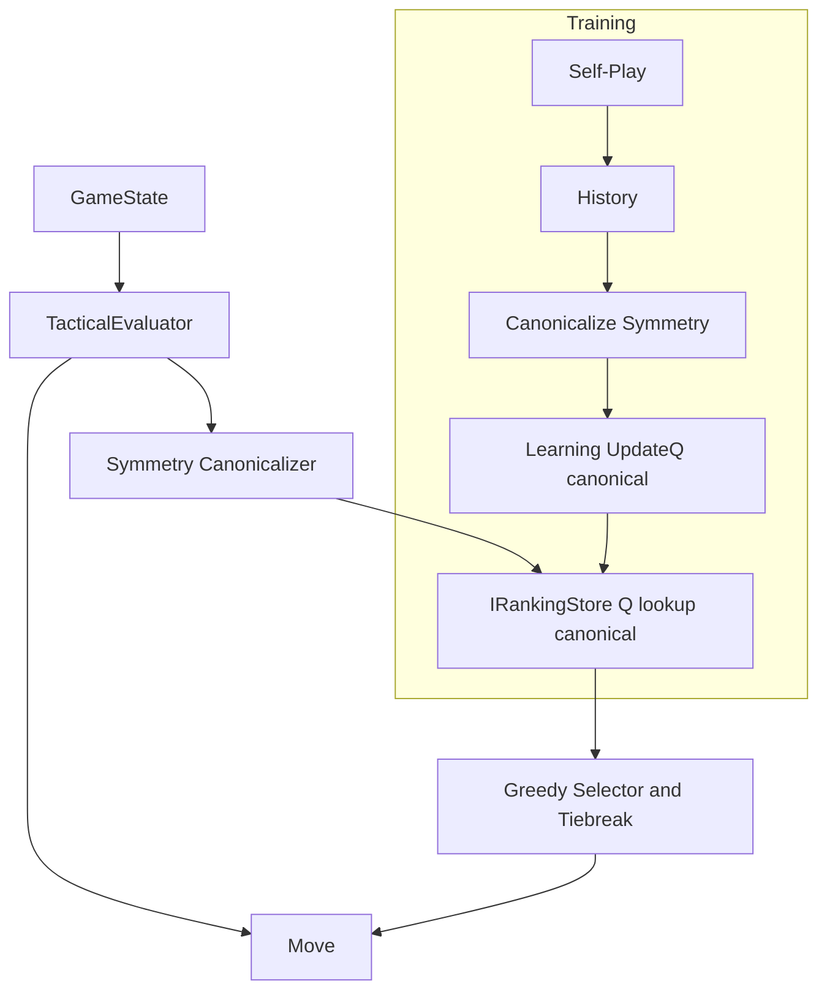

# Implementation Plan: Backend AI Upgrade (Greedy + Tactics + Symmetry)

Version: v1.01
Based on: `docs/specs/spec-engine-ai-technical_v1.01.md`
Status: Draft
Date: 2025-09-18

Baseline (implemented)
- Current AI uses a simple policy (epsilon-greedy during training) without tactical rules.
- No symmetry canonicalization; Q-lookup/update uses raw state keys.
- Learning pipeline `Learning.UpdateQ` updates Q-values directly from recorded histories.
- Gameplay endpoints auto-play one AI move using current `Policy`; self-play training exists and updates Q-values.

Delta (this plan)
- Add tactical shortcuts: win-in-1, block-in-1.
- Apply symmetry canonicalization for lookups and Q-updates; keys/moves stored canonically.
- Deterministic tie-break (smallest index) and missing Q treated as 0.
- Keep runtime epsilon=0; training may still explore.
- Optional observability: logs and metrics for tactical/selection paths.

Carry-over (future)
- Additional tactics: fork/block-fork.
- Optional compatibility migration (probe pre-canonical keys); default path = reset rankings.

---

## Project Structure and Conventions
- [x] Work Item 1: Establish AI upgrade scaffolding and folders
  - [x] Task 1: Create domain utilities for symmetry and tactics
    - [x] Step 1: Add `Domain/Symmetry` utility for transforms and index mapping.
    - [x] Step 2: Add `Domain/TacticalEvaluator` for win-in-1 and block-in-1 checks.
  - [x] Task 2: Prepare Policy refactor surface
    - [x] Step 1: Review existing `Domain/Policy` class and its `SelectMove` API.
    - [x] Step 2: Define new deterministic tie-break and missing-Q=0 behavior in the public contract.
  - **Files**:
    - `src/api/Tnc.Games.TicTacToe.Api/Domain/Symmetry.cs`: New static helper with transforms + index maps.
    - `src/api/Tnc.Games.TicTacToe.Api/Domain/TacticalEvaluator.cs`: New static helper for tactical checks.
    - `src/api/Tnc.Games.TicTacToe.Api/Domain/Policy.cs`: Update/extend as needed.
  - **Work Item Dependencies**: None.
  - **User Instructions**: None.

## Engine/Domain: Symmetry Canonicalization
- [x] Work Item 2: Implement 3x3 board symmetry utilities
  - [x] Task 1: Define 8 transforms and move index mapping
    - [x] Step 1: Represent board indices (0-8) mapping for Identity, Rot90, Rot180, Rot270, FlipH, FlipV, FlipMainDiag, FlipAntiDiag.
    - [x] Step 2: Implement `ApplyTransform(char[] board, Transform t) -> char[]` and `MapMoveIndex(int move, Transform t) -> int`.
  - [x] Task 2: Canonicalization function
    - [x] Step 1: Compute all 8 transformed keys via `BoardEncoding.ToStateKey` and choose lexicographically smallest key and its transform.
    - [x] Step 2: Return `(canonicalKey, chosenTransform)`.
  - **Files**:
    - `src/api/Tnc.Games.TicTacToe.Api/Domain/Symmetry.cs`: Add types `Transform` enum, map arrays, helpers described.
  - **Work Item Dependencies**: Work Item 1.
  - **User Instructions**: None.

## Engine/Domain: Tactical Shortcuts
- [x] Work Item 3: Implement tactical evaluator (win-in-1, block-in-1)
  - [x] Task 1: Win-in-1 check
    - [x] Step 1: For each legal move, clone `GameState`, apply move for current player, return earliest index that results in `GameStatus.WinX/WinO` for current player.
  - [x] Task 2: Block-in-1 check
    - [x] Step 1: If no winning move, for each legal move, clone state, apply move, then check if opponent has any immediate win; prefer smallest move that prevents all opponent immediate wins.
  - **Files**:
    - `src/api/Tnc.Games.TicTacToe.Api/Domain/TacticalEvaluator.cs`: Static methods `TryWinIn1`, `TryBlockIn1`.
  - **Work Item Dependencies**: Work Item 1.
  - **User Instructions**: None.

## Engine/Domain: Policy Refactor
- [x] Work Item 4: Update `Policy` to use tactics, canonicalization, deterministic greedy selection
  - [x] Task 1: Integrate tactical shortcuts
    - [x] Step 1: In `SelectMove`, call `TacticalEvaluator.TryWinIn1`; if found, return smallest-index winning move.
    - [x] Step 2: If not found, call `TacticalEvaluator.TryBlockIn1`; if found, return smallest-index block move.
  - [x] Task 2: Greedy with canonicalization
    - [x] Step 1: Generate `boardStrings`, `legalMoves`.
    - [x] Step 2: Compute `(canonicalKey, transform)` via `Symmetry.GetCanonicalKeyAndTransform(boardStrings)`.
    - [x] Step 3: For each legal move `m`, compute canonical `mc = Symmetry.MapMoveIndex(m, transform)` and query `IRankingStore.Get(canonicalKey, mc) ?? 0.0`.
    - [x] Step 4: Pick max; tie-break deterministically by smallest original `m`.
  - [x] Task 3: Runtime vs training behavior
    - [x] Step 1: Preserve existing epsilon exploration path for training (self-play). Ensure runtime gameplay uses epsilon=0.
    - [x] Step 2: Keep constructor/API accepting epsilon and RNG for training usage; greedy path ignores epsilon when configured to 0.
  - **Files**:
    - `src/api/Tnc.Games.TicTacToe.Api/Domain/Policy.cs`: Implement decision flow and deterministic tie-break; missing Q as 0.0.
  - **Work Item Dependencies**: Work Items 2-3.
  - **User Instructions**: None.

## Learning Pipeline: Canonical Updates
- [x] Work Item 5: Canonicalize state/move before Q-updates
  - [x] Task 1: Update `Learning.UpdateQ` call sites
    - [x] Step 1: Ensure histories are recorded as `(canonicalStateKey, canonicalMoveIndex)`.
    - [x] Step 2: If histories currently store original orientation, canonicalize inside `Learning.UpdateQ` prior to `store.Get/Set`.
  - [x] Task 2: Implement canonicalization inside `Learning.UpdateQ`
    - [x] Step 1: For each `(stateKey, move)`, reconstruct board or pass boardStrings earlier to compute canonical transform; preferred: change history to carry boardStrings or canonical stateKey directly at capture time to avoid re-hydration.
    - [x] Step 2: Use `Symmetry` to get `stateKeyC` and mapped `moveC`; update Q against canonical.
  - **Files**:
    - `src/api/Tnc.Games.TicTacToe.Api/Domain/Learning.cs`: Add canonicalization to updates; adjust history-building callers accordingly.
    - `src/api/Tnc.Games.TicTacToe.Api/Endpoints/SelfPlayEndpoints.cs`: At history append points, capture canonical pairs if simpler.
  - **Work Item Dependencies**: Work Item 2.
  - **User Instructions**: Plan to reset rankings after deploy to avoid mixed key spaces.

## API: Use updated Policy in gameplay and training
- [x] Work Item 6: Wire updated Policy into endpoints
  - [x] Task 1: Self-Play endpoints already pass `Policy(0.15, rng)`; keep but ensure new `Policy` works with training.
    - [x] Step 1: Verify `SelfPlayEndpoints` uses canonicalized history (see Work Item 5).
  - [x] Task 2: Gameplay endpoint move selection (HvsAI)
    - [x] Step 1: Locate gameplay endpoint applying AI move after human move.
    - [x] Step 2: Replace any ad-hoc move selection with `Policy` using epsilon=0.
  - **Files**:
    - `src/api/Tnc.Games.TicTacToe.Api/Endpoints/*Gameplay*.cs`: Update AI move selection to `Policy.SelectMove` with epsilon=0.
    - `src/api/Tnc.Games.TicTacToe.Api/Endpoints/SelfPlayEndpoints.cs`: Ensure canonical histories or rely on `Learning` canonicalization.
  - **Work Item Dependencies**: Work Items 4-5.
  - **User Instructions**: None.

## Persistence & Compatibility
- [x] Work Item 7: Rankings canonical key policy and migration
  - [x] Task 1: Document canonical-only keys for `IRankingStore`
    - [x] Step 1: Update summary docs/comments on `IRankingStore` and export/import to state keys are canonical.
  - [x] Task 2: Migration strategy
    - [x] Step 1: Provide admin instruction to reset rankings (simplest) or implement one-time compat read (optional).
    - [x] Step 2: If compat layer is desired: on read miss for canonical key, optionally probe original `stateKey` or symmetric variants (feature-flagged) and re-store canonically. Default: disabled.
  - **Files**:
    - `src/api/Tnc.Games.TicTacToe.Api/Domain/IRankingStore.cs`: Doc comments clarifying canonical keys (no interface change).
    - `docs/specs/spec-persistence-technical_v0.01.md`: Note that stored keys are canonical (add a line if missing).
  - **Work Item Dependencies**: Work Items 2, 5.
  - **User Instructions**: After deploy, reset rankings via admin endpoint.

## Observability
- [x] Work Item 8: Logging and metrics
  - [x] Task 1: Logs
    - [x] Step 1: Add debug/info logs in policy: flags `winIn1`, `blockIn1`, chosen `transform`, `bestQ`, selected move index.
  - [x] Task 2: Metrics (optional)
    - [x] Step 1: Add counters for `ai_tactical_shortcuts_total` with labels `type=win|block`.
  - **Files**:
    - `src/api/Tnc.Games.TicTacToe.Api/Domain/Policy.cs`: Logging hooks.
    - `src/api/Tnc.Games.TicTacToe.Api/Observability/*` or existing telemetry integration: metric counters (optional).
  - **Work Item Dependencies**: Work Items 3-4.
  - **User Instructions**: None.

## Tests
- [x] Work Item 9: Unit tests for Symmetry
  - [x] Task 1: Index mapping correctness
    - [x] Step 1: Verify `MapMoveIndex` round-trip under `t` and `t^-1`.
  - [x] Task 2: Canonical key selection
    - [x] Step 1: For known symmetric boards (e.g., center-only, corner-only), ensure expected canonical transform is chosen.
  - **Files**:
    - `tests/unit/TicTacToe.Engine.Tests/Domain/SymmetryTests.cs`
  - **Work Item Dependencies**: Work Item 2.
  - **User Instructions**: None.
- [x] Work Item 10: Unit tests for TacticalEvaluator
  - [x] Task 1: Win-in-1 detection
    - [x] Step 1: Create board with immediate win; expect matching index.
  - [x] Task 2: Block-in-1 detection
    - [x] Step 1: Create board where opponent threatens immediate win; expect correct block index.
  - **Files**:
    - `tests/unit/TicTacToe.Engine.Tests/Domain/TacticalEvaluatorTests.cs`
  - **Work Item Dependencies**: Work Item 3.
  - **User Instructions**: None.
- [x] Work Item 11: Unit tests for Policy
  - [x] Task 1: Deterministic tie-break
    - [x] Step 1: Equal Q-values for multiple moves; expect smallest index.
  - [x] Task 2: Missing Q treated as 0
    - [x] Step 1: Some moves null, some valued; verify selected move and no randomness.
  - [x] Task 3: Symmetry lookup
    - [x] Step 1: Populate `IRankingStore` with a canonical state/move Q; verify selection works from rotated/reflected boards.
  - [x] Task 4: Tactics override greedy
    - [x] Step 1: Setup board where win-in-1 exists though greedy would pick another; verify tactic chosen.
  - **Files**:
    - `tests/unit/TicTacToe.Engine.Tests/Domain/PolicyTests.cs`
  - **Work Item Dependencies**: Work Items 2-4.
  - **User Instructions**: None.
- [x] Work Item 12: Integration tests (API)
  - [x] Task 1: Gameplay AI move correctness
    - [x] Step 1: Use integration test to POST turn and assert AI picks block-in-1 or win-in-1.
  - [x] Task 2: Self-play end-to-end
    - [x] Step 1: Run small `n` self-play and assert no failures; optionally compare win/draw ratio regression.
  - **Files**:
    - `tests/integration/TicTacToe.Api.Tests/GameplayAiPolicyTests.cs`
    - `tests/integration/TicTacToe.Api.Tests/SelfPlayCanonicalizationTests.cs`
  - **Work Item Dependencies**: Work Items 4-6.
  - **User Instructions**: None.

## UI and Admin
- [x] Work Item 13: Admin guidance and tooling
  - [x] Task 1: Doc change
    - [x] Step 1: Update README or a short doc on resetting rankings after upgrade.
  - [x] Task 2: Optional UI affordance
    - [x] Step 1: Add a button in Admin panel to reset rankings with confirmation.
  - **Files**:
    - `docs/specs/spec-persistence-technical_v0.01.md` or README: Add migration note.
    - `src/web/Tnc.Games.TicTacToe.Web/Pages/Admin.razor` (if exists): Add reset button.
  - **Work Item Dependencies**: Work Item 7.
  - **User Instructions**: Use admin reset once after deploy.

---

Summary of sequencing/dependencies:
1) Scaffolding (Work Item 1)
2) Symmetry (2) -> Tactics (3) -> Policy (4)
3) Learning canonicalization (5) depends on Symmetry
4) API wiring (6) depends on Policy and Learning updates
5) Persistence/compat docs (7) after Symmetry/Learning
6) Observability (8) after Policy
7) Tests (9–12) follow their respective components
8) Admin docs/UI (13) after persistence decision

---

# Architecture

## Overall Technical Approach
- Enhance AI with:
  - Tactical layer (win-in-1, block-in-1).
  - Greedy Q-based selection with deterministic tie-break.
  - Symmetry canonicalization for consistent Q lookups/updates.
- Training remains epsilon-greedy; runtime gameplay uses epsilon=0.
- RankingStore uses canonical keys moving forward; recommend reset/migration.

## Frontend
- No functional change needed for AI logic.
- Optional: Admin UI button to reset rankings post-upgrade.
- Pages:
  - `Pages/Training.razor`: unchanged.
  - `Pages/Admin.razor` (if present): add reset action (optional).

## Backend
- Domain:
  - `Symmetry`: Board transforms, canonical key, move index mapping.
  - `TacticalEvaluator`: Win/block-in-1 detection.
  - `Policy`: Orchestrates tactics first, then canonical greedy lookup with deterministic tie-break.
  - `Learning`: Canonicalizes state/move before Q updates.
- Endpoints:
  - Gameplay: Ensure AI uses `Policy` (epsilon=0).
  - Self-Play: Continues to use `Policy(epsilon>0)` for exploration; ensures canonical history paths feed `Learning`.
- Persistence:
  - `IRankingStore`: Keys are canonical; export/import remain unchanged, but data is now canonical.
- Observability:
  - Logs for tactical decisions and transform chosen; optional metrics counters.

Key considerations:
- Determinism: No RNG during runtime unless explicitly needed.
- Migration: Reset rankings or implement a compatibility read to avoid stale non-canonical keys.
- Performance: Symmetry operations are lightweight (array index mapping); precompute mapping tables to avoid per-call allocations.
- Testing: Unit-test mapping, tactics, and policy paths; integration-test endpoints for correctness.
