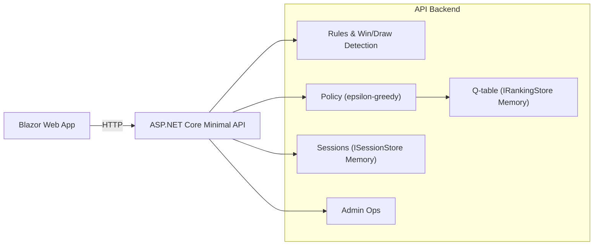

# Architecture

## Overall Technical Approach
- Separate UI and API services.
- UI: Blazor Web App (.NET 8) SSR + interactive server.
- API: ASP.NET Core minimal API. Single instance initially.
- Game engine and AI policy live in API backend. Global Q-table in memory (pluggable later).
- Observability with OpenTelemetry (logs, metrics, traces). Aspire-ready.
- CORS: dev allow-any; restricted in non-prod/prod.
- Admin endpoints behind Basic auth.

## Frontend
- Pages
  - `Index.razor`: Home/play page with board, status, controls.
  - `Training.razor`: Self-play trigger and summary.
  - `Admin.razor`: Export/import/reset rankings, view stats (Basic auth prompt).
- Components
  - `BoardGrid`: 3x3 grid, keypad 1-9 mapping, click -> `/turn`.
  - `GameStatus`: Shows status, next player, move count.
- Services
  - `ApiClient`: wraps `/api/v1` calls; appends `sessionId` query parameter.

## Backend
- Minimal API with versioned routes `/api/v1`.
- Endpoints
  - `POST /turn`: apply human move and auto-play AI if applicable.
  - `GET /state`: get current session state.
  - `POST /selfplay`: run N AI-vs-AI games sequentially.
  - Admin: `POST /admin/rankings/reset`, `GET /admin/rankings/export`, `POST /admin/rankings/import`, `GET /admin/stats`.
- Domain
  - `Rules`, `GameState`, `Player`, `Cell`, `GameStatus`.
  - `Policy` (epsilon-greedy, tie-breaker), `Learning` (end-of-game updates with alpha and clamping).
- Persistence (in-memory initial)
  - `ISessionStore`, `IRankingStore` (+ optional `IStatsStore`).
- Telemetry
  - OpenTelemetry setup, counters, histograms, span attributes, OTLP exporter.
